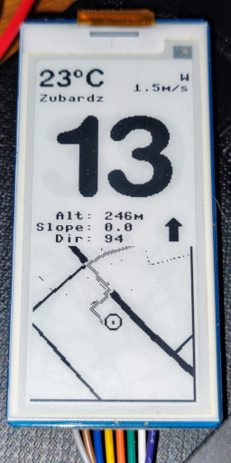

<h1 align="center">
    Cyclocomputer
</h1>
<h4 align="center">
    Raspberry Pi Pico project. Advanced cyclometer with e-paper display.
</h4>

    

<h2 align="center">Features:</h2>

    

        <ul>
            <li>Temperature</li>
            <li>Battery level icon and charging icon</li>
            <li>City name based on current GPS coordinates</li>
            <li>Wind speed and direction</li>
            <li>Speed in km/h</li>
            <li>Altitude, slope and moving direction based on GPS data</li>
            <li>Wind direction relative to moving direction</li>
            <li>Minimalistic map preview of your vicinity</li>
            <li>Selected route displaying on the map preview</li>
        </ul>
    

<h2 align="center">Hardware:</h2>

    

        <ul>
            <li>Raspberry Pi Pico</li>
            <li>
                <a href="https://www.waveshare.com/wiki/Pico-ePaper-2.9">
                    Pico e-Paper 2.9'' 296x128px
                </a>
            </li>
            <li>
                <a href="https://waveshare.com/wiki/Pico-BLE">
                    Pico-BLE Bluetooth 5.1
                </a>
                (not needed in raspberry pi versions with built-in bluetooth/wifi module)
            </li>
            <li>
                <a href="https://www.waveshare.com/wiki/Pico-UPS-B">
                    Pico UPS B
                </a>
                + Power Supply Li-po Battery or any other compatible 3.7V power source
            </li>
            <li>
                Magnetic sensor and magnet for your bike's fork. You can get those from old regular cyclometer or buy any cheap one.  
            </li>
        </ul>
    

